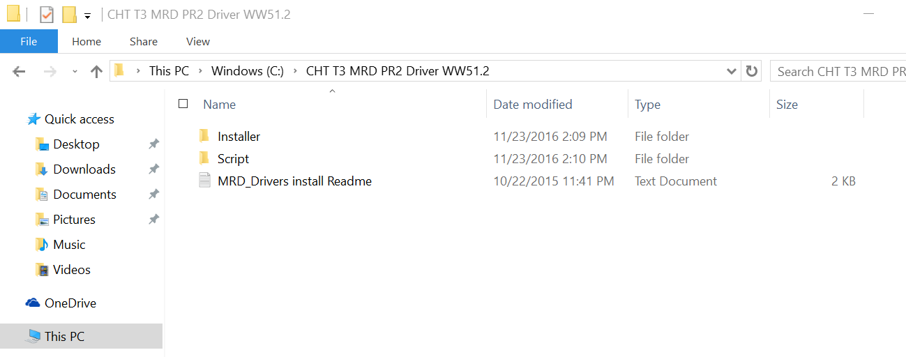

# LattePanda_Drivers
----------------

Contains the following:

- LattePanda_2G32GB_Drivers  
- LattePanda_4G64GB_Drivers

### How to install:   

1. Download the right driver package.
2. Unzip the driver pack and copy the "CHT T3 MRD PR2 Driver WW51.2" folder to "C:\"  
      
3. Open CMD from Windows system.   
   *  Click on Home button
   *  Search "CMD" or "Command Prompt"
   *  Right click on "Command Prompt", Run as administrator!!!
             **NOTE**: Run as administrator!!! 
             You WON'T install the drivers successfully without this step!!!  
4. Start driver installation by running the following commands. 
   * cd C:\
   * cd "CHT T3 MRD PR2 Driver WW51.2"
   * cd Script
   * Install.bat  
       
5. Accept "Install the driver software anyway" for Windows security warning.   
     
6. Success to install the driver pack after 1-2 minutes.   
     

### Social Media:

Follow us on Twitter for updates and more information: https://twitter.com/LattePandaCN

Facebook LattePanda Group: https://www.facebook.com/groups/LattePandaMakers/

### Helpful Links:

Do you have a business inquiry for a commercial product? Please contact *lattepanda@outlook.com*

Do you have a LattePanda project to show us? Post on our [cool projects forum](http://www.lattepanda.com/forum/viewforum.php?f=11) or drop us a tweet *@lattepandacn*

If you have any further questions please let us know on our [community forum](http://www.lattepanda.com/forum) or in the comments below.
